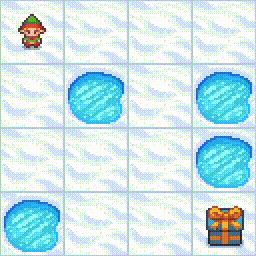

---
tags:
- FrozenLake-v1-4x4-slippery
- q-learning
- reinforcement-learning
- custom-implementation
model-index:
- name: q-table-frozen-lake
  results:
  - task:
      type: reinforcement-learning
      name: reinforcement-learning
    dataset:
      name: FrozenLake-v1-4x4-slippery
      type: FrozenLake-v1-4x4-slippery
    metrics:
    - type: mean_reward
      value: 0.75 +/- 0.43
      name: mean_reward
      verified: false
---

# **Q-Learning** Agent playing **FrozenLake-v1**

This is a trained **Q-Learning** agent playing **FrozenLake-v1-slippery**.



## Usage

```python
import gymnasium as gym
from huggingface_hub import snapshot_download

# https://github.com/libertininick/r2seedo
from r2seedo.io import load_n_verify_model

# Download model snapshot from Hugging Face Hub
# https://huggingface.co/libertininick/q-table-frozen-lake
repo_local_path = snapshot_download(
  repo_id="libertininick/q-table-frozen-lake", 
  local_dir="path/to/download",
)

# Load the model from the snapshot
agent = load_n_verify_model(repo_local_path)

# Create the environment
env = gym.make(
  id="FrozenLake-v1",
  map_name="4x4",
  is_slippery=True,
)
```
